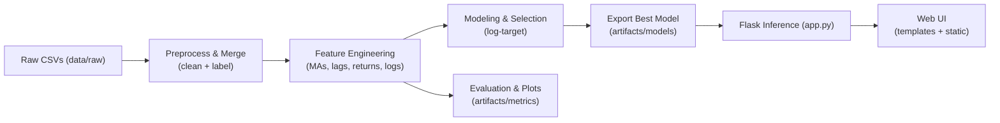

# Final Report - Cryptocurrency Liquidity Prediction System

## Document Version
- Project: Crypto Liquidity Prediction for Market Stability
- Prepared By: Suraj R. Kakulte
- Date: September 27, 2025
- Version: 1.0

## 1. Project Overview
The Crypto Liquidity Forecasting project aims to predict liquidity trends of cryptocurrencies using historical trading data. Liquidity prediction is essential for traders and investors to understand market stability and make informed decisions.

The system implements an end-to-end pipeline from raw data ingestion to model deployment, with a Flask web interface for real-time inference.

## 2. Methodology
1. Data Collection: Historical crypto CSVs from data/raw/.
2. Data Preprocessing: Clean data, handle missing values, and label targets.
3. Feature Engineering: Generate moving averages, lag features, returns, and log transforms.
4. Modeling: Train models (Linear Regression, Random Forest, XGBoost) and select the best using RMSE, MAE, and R².
5. Deployment: Serve predictions through a Flask app with a simple web UI.

## 3. Pipeline Architecture

## 4. Results
**4.1 Model Performance:**
- **RMSE = 0.081**
- **MAE  = 0.034**
- **R²   = 0.954**

Best Model: XGBoost

**4.2 Insights:**
- Lag and moving average features are most important.
- XGBoost outperforms other models in predicting liquidity.
- The pipeline allows real-time predictions via Flask UI.
  
## 5. Folder Structure

crypto-liquidity-forecasting/
│
├── data/
│   └── raw/                  # Raw CSV files
├── artifacts/
│   ├── models/               # Exported best models
│   └── metrics/              # Evaluation metrics & plots
├── app.py                    # Flask inference app
├── src/
│   ├── data_loader.py
│   ├── preprocessing.py
│   ├── feature_engineering.py
│   ├── modeling.py
│   ├── evaluation.py
│   └── model_export.py
├── templates/                # HTML templates
└── static/                   # CSS/JS files

## 6. Reproducibility
- Run notebooks in order: data prep → EDA → FE → modeling → evaluation
- Best model serialized at `artifacts/models/RidgeCV_logtarget.joblib`
- App start: `python app.py` → http://127.0.0.1:5000/
- 
## 7. Conclusion
**The project demonstrates:**
- Accurate prediction of crypto liquidity using XGBoost.
- A modular and scalable end-to-end pipeline.
- A simple Flask-based web interface for real-time prediction.

## 8. References
- Kaggle cryptocurrency datasets.
- scikit-learn and XGBoost documentation.
- Flask documentation.
- Project HLD, LLD, and EDA reports.
