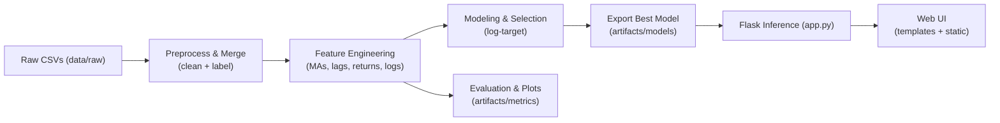

# Low-Level Design (LLD) Document - Cryptocurrency Liquidity Prediction System

## Document Version
- Project Name: Cryptocurrency Liquidity Prediction for Market Stability
- Prepared By: Suraj R. Kakulte
- Date: 27-Sep-2025
- Version: 1.0 

## 1. Introduction
This Low-Level Design document provides a detailed explanation of the Crypto Liquidity Forecasting project, including module-level architecture, data structures, algorithms, and implementation specifics. It acts as a blueprint for developers to implement the system.

**Objective:**
Predict cryptocurrency liquidity using historical market and trading data, and deploy the prediction model via a Flask web application with a user-friendly interface.

## 2. System Overview
- Input: Historical CSV files containing crypto trading data (price, volume, timestamp, etc.) stored in data/raw/.
- Processing: Data preprocessing, feature engineering, model training, evaluation, and selection.
- Output: Predictions available through a Flask web application (app.py).

## 3. Module-Wise Design
**3.1 Data Loader Module:**

Purpose: Load all raw CSVs for further processing.

Functions:
- load_csv(file_path: str) -> pd.DataFrame
- load_all_csv(folder_path: str) -> pd.DataFrame

Data Structures: pandas.DataFrame

**3.2 Preprocessing Module:**

Purpose: Clean, merge, and label the data.
Functions:
- clean_data(df) → Handles missing data, duplicates, and outliers
- label_data(df) → Generates the target variable (e.g., log-target or liquidity class)

Data Structures: DataFrame with labeled and cleaned data

**3.3 Feature Engineering Module:**

Purpose: Transform raw data into model-ready features.
Functions:
- compute_moving_averages(df, windows)
- compute_lag_features(df, lags)
- compute_returns(df)
- compute_log_transform(df, cols)

Data Structures: DataFrame with numeric arrays for each feature

**3.4 Modeling Module:**

Purpose: Train predictive models and select the best-performing one.
Functions:
- train_model(X_train, y_train, model_type)
- evaluate_model(model, X_test, y_test)
- select_best_model(models)

Algorithms:
- Regression models: Linear Regression, Random Forest, XGBoost
- Metrics: RMSE, MAE, R²

**3.5 Evaluation Module:**

Purpose: Generate metrics and plots to evaluate model performance.
Functions:
- plot_metrics(metrics_dict) → Save visualizations
- save_metrics(output_dir) → Save metrics in artifacts/metrics/

Data Structures: Dictionary of metrics and Matplotlib/Seaborn plots

**3.6 Model Export Module:**

Purpose: Save the trained model for inference.
Functions:
- save_model(model, path) → Stores .pkl or .joblib
- load_model(path) → Loads the saved model for Flask inference

**3.7 Flask Inference Module:**

Purpose: Serve predictions through an API.
Endpoints:
- /predict → Input: JSON of features, Output: predicted liquidity
- /health → API status check

Functions:
- predict(input_json) → Returns prediction

**3.8 Web UI Module:**

Purpose: Provide an interface to interact with the model.
Components:
- templates/ → HTML forms and output display
- static/ → CSS/JS for UI
- Form submissions trigger Flask endpoints to return predictions

## 4. Data Flow Diagram:

## 5. Libraries & Dependencies
- pandas, numpy → Data handling
- scikit-learn, xgboost → Modeling
- matplotlib, seaborn → Plots & visualizations
- Flask → Web app
- joblib → Model serialization

## 6. Implementation Notes
- Modular structure: Each module in src/ handles a specific step.
- All configurations (like model parameters) in a config file or .env.
- Logging and error handling in Flask app for API requests.
- Ensure reproducibility by fixing random seeds in modeling.
