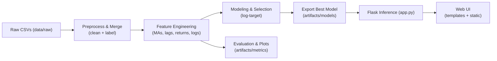

# Crypto Liquidity Forecasting – Pipeline Architecture

## 1. Overview
This document describes the data processing and prediction pipeline for the Crypto Liquidity Forecasting project. It explains how data flows from raw CSVs to final predictions via preprocessing, feature engineering, modeling, and deployment.

## 2. Pipeline Steps
**2.1 Raw Data Loading:**
- Load historical cryptocurrency data from CSV files in data/raw/.
- Ensure all CSVs are merged into a single DataFrame.

**2.2 Preprocessing & Labeling:**
- Clean missing values and duplicates.
- Generate target variable (log-target or liquidity class).

**2.3 Feature Engineering:**
- Compute moving averages (MAs) and lag features.
- Calculate returns and logarithmic transformations.

**2.4 Modeling & Selection:**
- Train multiple models: Linear Regression, Random Forest, XGBoost.
- Evaluate using RMSE, MAE, R².
- Select the best-performing model.

**2.5 Evaluation & Metrics:**
- Generate plots for prediction vs actual values.
- Save metrics and plots in artifacts/metrics/.

**2.6 Model Export:**
- Save the selected model in artifacts/models/ for inference.

**2.7 Flask Inference:**
- Load the exported model.
- Provide REST API endpoint /predict for real-time predictions.

**2.8 Web UI:**
- Render predictions via templates in templates/.
- Static assets (CSS/JS) in static/.

## 3. Pipeline Data Flow Diagram


## 4. Folder Structure (Repository Layout)
```
crypto_liquidity_project/
├── data/
│   ├── raw/
│   └── processed/
│       ├── merged_coin_gecko.csv
│       └── engineered_features_lag.csv
├── notebooks/
│   ├── data_preparation.ipynb
│   ├── eda.ipynb
│   ├── feature_engineering.ipynb
│   ├── modeling.ipynb
│   └── evaluation_testing.ipynb
├── artifacts/
│   ├── models/
│   │   └── RidgeCV_logtarget.joblib
│   └── metrics/
│       └── results.csv
├── templates/index.html
├── static/style.css
├── app.py
├── docs/
│   ├── HLD.md
│   ├── LLD.md
│   └── PIPELINE_ARCHITECTURE.md
└── reports/
    ├── EDA_REPORT.md
    └── FINAL_REPORT.md
```
## 5. Notes
- The pipeline is modular, making it easy to add new features or models.
- Metrics and visualizations are stored separately for reproducibility and analysis.
- Flask app provides a real-time inference interface, allowing the pipeline to be production-ready.

## 6. Run Commands
```
python -m venv .venv
.venv\Scripts\activate
pip install -r requirements.txt
python app.py
```
