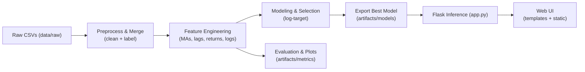
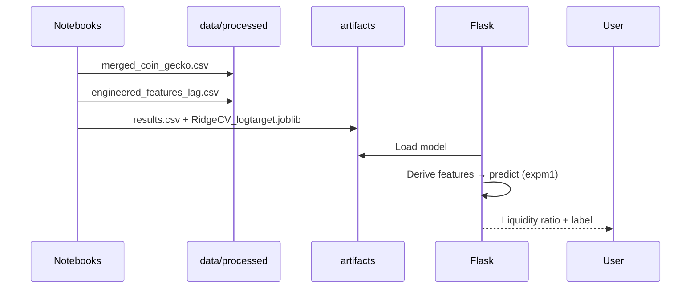

# Crypto Liquidity Forecasting

## Project Overview
This project predicts cryptocurrency liquidity using historical trading data. It includes an end-to-end pipeline: data preprocessing, feature engineering, model training, evaluation, and deployment via a Flask web interface.

## Table of Contents
- [Project Overview](#project-overview)
- [Folder Structure](#folder-structure)
- [Config File](#config-file)
- [Pipeline Overview](#pipeline-overview)
- [UI Screenshots](#ui-screenshots)
- [How to Run](#how-to-run)
- [Notes](#notes)
- [References](#references)

## Folder Structure

```
crypto_liquidity_project/
├── data/
│   ├── raw/                          # CoinGecko CSVs (input)
│   └── processed/
│       ├── merged_coin_gecko.csv
│       └── engineered_features_lag.csv
├── notebooks/
│   ├── data_preparation.ipynb
│   ├── eda.ipynb
│   ├── feature_engineering.ipynb
│   ├── modeling.ipynb
│   └── evaluation_testing.ipynb
├── artifacts/
│   ├── models/
│   │   └── RidgeCV_logtarget.joblib  # best model (log-target)
│   └── metrics/
│       └── results.csv               # model comparison
├── templates/
│   └── index.html                    # Flask UI (minimal inputs)
├── static/
│   └── style.css                     # modern glass UI
├── app.py                            # Flask server (inference)
├── docs/
│   ├── HLD.md
│   ├── LLD.md
│   └── PIPELINE_ARCHITECTURE.md
└── reports/
    ├── EDA_REPORT.md
    └── FINAL_REPORT.md
```

## Config File
The project uses `config.py` for paths, feature columns, model parameters, and Flask settings.

**Usage Example:**
```python
from config import RAW_DATA_DIR, MODEL_DIR, XGBOOST_PARAMS
import pandas as pd
from xgboost import XGBRegressor

# Load data
data = pd.concat([pd.read_csv(RAW_DATA_DIR + f) for f in os.listdir(RAW_DATA_DIR)])

# Initialize XGBoost model
model = XGBRegressor(**XGBOOST_PARAMS)
```

## Pipeline Overview
1. Load raw CSVs → `src/data_loader.py`
2. Preprocess & label → `src/preprocessing.py`
3. Feature engineering → `src/feature_engineering.py`
4. Model training & selection → `src/modeling.py`
5. Evaluation & plots → `src/evaluation.py`
6. Export best model → `src/model_export.py`
7. Real-time inference → `app.py` (Flask)
8. Web UI → `templates/` & `static/`


## Orchestration (sequence)


## UI Screenshots
### Home Page


### Data Inserting Page


### Data Visualization Page


### Prediction UI


### Final Output UI


## How to Run
1. Install dependencies:
```bash
pip install -r requirements.txt
```
2. Update `config.py` paths or model parameters if needed.
3. Train models via `src/modeling.py`.
4. Start Flask app:
```bash
python app.py
```
5. Access Web UI at `http://127.0.0.1:5000`

## ✅ Submission Checklist

- [ ] Source code (notebooks, `app.py`, templates, CSS, artifacts)
- [ ] EDA Report
- [ ] HLD & LLD
- [ ] Pipeline Architecture
- [ ] Final Report
- [ ] Best model (`artifacts/models/*.joblib`) + metrics CSV
- [ ] Processed data CSVs (`data/processed/*.csv`)

## Notes
- Keep sensitive credentials out of `config.py`; use `.env` if needed.
- All artifacts (models, metrics) are stored in `artifacts/`.
- Ensure all raw CSV files are placed in data/raw/.

## References
- scikit-learn, XGBoost, pandas, Flask documentation
- Project HLD, LLD, and EDA reports
