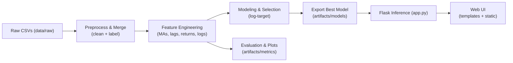

# Crypto Liquidity Prediction System

## Overview
This project predicts cryptocurrency liquidity using historical trading data. It includes an end-to-end pipeline with preprocessing, feature engineering, model training, evaluation, and deployment via a Flask web interface.

## Folder Structure
```
crypto-liquidity-forecasting/
├── config.py
├── data/
│   └── raw/
├── artifacts/
│   ├── models/
│   └── metrics/
├── src/
│   ├── data_loader.py
│   ├── preprocessing.py
│   ├── feature_engineering.py
│   ├── modeling.py
│   ├── evaluation.py
│   └── model_export.py
├── app.py
├── templates/
├── static/
├── ui_screenshots/
└── README.md
```

## Config File
The project uses `config.py` for paths, feature columns, model parameters, and Flask settings.

**Usage Example:**
```python
from config import RAW_DATA_DIR, MODEL_DIR, XGBOOST_PARAMS
import pandas as pd
from xgboost import XGBRegressor

# Load data
data = pd.concat([pd.read_csv(RAW_DATA_DIR + f) for f in os.listdir(RAW_DATA_DIR)])

# Initialize XGBoost model
model = XGBRegressor(**XGBOOST_PARAMS)
```

## Pipeline Overview
1. Load raw CSVs → `src/data_loader.py`
2. Preprocess & label → `src/preprocessing.py`
3. Feature engineering → `src/feature_engineering.py`
4. Model training & selection → `src/modeling.py`
5. Evaluation & plots → `src/evaluation.py`
6. Export best model → `src/model_export.py`
7. Real-time inference → `app.py` (Flask)
8. Web UI → `templates/` & `static/`



## UI Screenshots
### Home Page


### Prediction Page


### Metrics Page


### Additional UI 1


### Additional UI 2


## How to Run
1. Install dependencies:
```bash
pip install -r requirements.txt
```
2. Update `config.py` paths or model parameters if needed.
3. Train models via `src/modeling.py`.
4. Start Flask app:
```bash
python app.py
```
5. Access Web UI at `http://127.0.0.1:5000`

## Notes
- Keep sensitive credentials out of `config.py`; use `.env` if needed.
- All artifacts (models, metrics) are stored in `artifacts/`.

## References
- scikit-learn, XGBoost, pandas, Flask documentation
- Project HLD, LLD, and EDA reports
